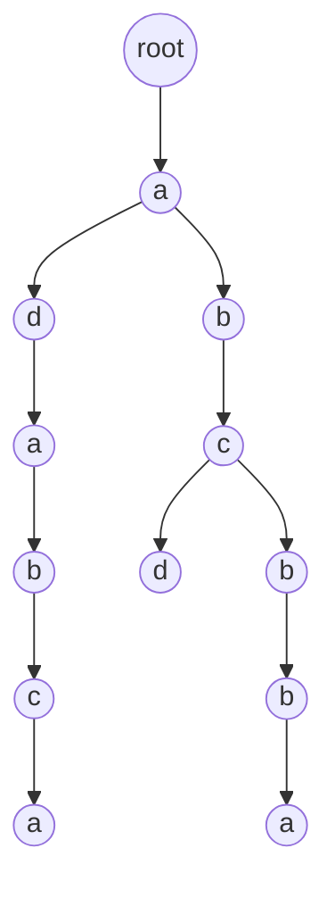

### AC自动机

#### 1、创建这三个单词的字典树

* `List<String> sensitiveList = Arrays.asList("abcd", "abcbba", "adabca");`

#### 2、字典树样子

##### 3、创建AC自动机

* 添加敏感词生成字典树
* 敏感词加上kmp失败指针
    * 主要方法：`getAcTrieNode(Map.Entry<Character, ACTrieNode> entry, ACTrieNode parentNode)`

##### 4、添加fail指针流程

* 从根节点开始,拿到第一层的a，将节点a的fail设置为root
    * 开始队列循环，按照BFS广度遍历，也就是层次遍历
    * 首先进来的是右边的b字符，拿到当前节点的getValue(),在拿到父节点a的getFailover()
    * 因为父节点a的getFailover()不是空的，a失败节点指向了root，而且父节点不好含b字符
    * 所以将父节点a的getFailover()值的getFailover()给了当前b节点，也就是b节点的failover
    * 因为a失败节点是root，所以b节点的failover就是root，回到了根节点
* 开始轮到d字符节点了，和b节点一样，d节点的failover也是root
* 轮到深度为3的c节点，也是指向root
* 轮到深度为3的a节点，此时情况不一样了
    * 父节点d的失败指针是指向root的，在从root中执行
    * 此时结果是：!parentNodeFailover.hasChild(entry.getKey())==false，不进入while，parentNodeFailover!=null
    * root开始找，找到了a字符 --> 失败指针指向深度为1的a节点
* 同理深度为4的节点b右，d,b左这3个节点，对应的失败节点为
    * b右的父节点深度为3的c节点，c失败指针指向root，root开始找没有b字符 --> 失败指针指向root
    * d的父节点深度为3的c节点，c失败指针指向root，root开始找没有d字符 --> 失败指针指向root
    * b左的父节点深度为3的a节点，a失败指针指向深度为1的a节点，a开始找,找到了b字符 --> 失败指针指向深度2的b节点
* 同理深度为5的节点b,c这2个节点，对应的失败节点为
    * b的父节点深度为4的`b`节点，`b`失败指针指向root，root开始找没有d字符 --> 失败指针指向root
    * c的父节点深度为4的b节点，b失败指针指向深度2的b节点，b开始找,找到了c字符 --> 失败指针指向深度3的c节点
* 同理深度为6的节点a右,a左这2个节点，对应的失败节点为
    * a右的父节点深度为5的b节点，b失败指针指向root，root开始找，找到了a字符 --> 失败指针指向深度为1的a节点
    * a左的父节点深度为5的c节点，c失败指针指向深度3的c节点，开始找没找到了a字符
      * 指针回退到c节点的失败节点，即回到了root，root开始找到了a字符 --> 失败指针指向深度为1的a节点

